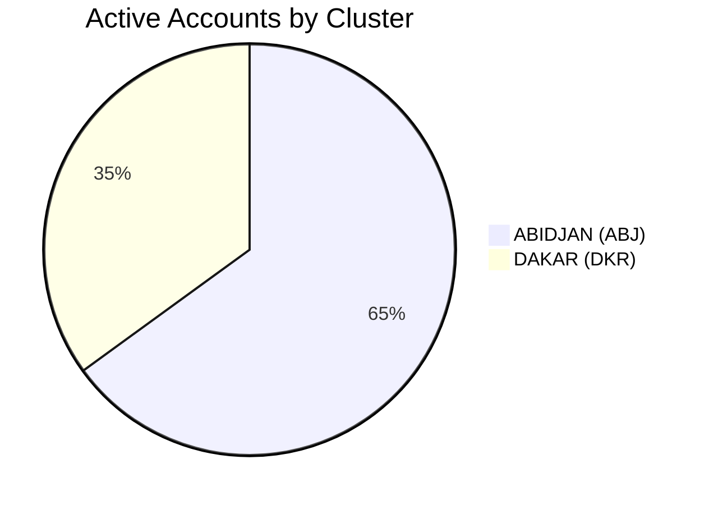

Voici une refonte complète de le page Dashboard pour ZillaSec, intégrant toutes les fonctionnalités clés du projet :

```markdown
# 🔐 ZillaSec - Access Intelligence Dashboard

## 🎯 Quick Actions
```python
quick_actions = [
    {"icon": "📤", "label": "New Analysis", "target": "/analyze"},
    {"icon": "📊", "label": "Generate Report", "target": "/reports"},
    {"icon": "🛡️", "label": "Risk Audit", "target": "/risks"},
    {"icon": "⚙️", "label": "API Settings", "target": "/settings"}
]
```

## 📊 Security Pulse
| Metric | Value | Δ 24h | Trend |
|--------|-------|-------|-------|
| **Total Accounts** | 2,847 | +12 | 📈 |
| **Active Sessions** | 142 | -5 | 📉 |
| **High Risk Accounts** | 38 | +3 | 🔴 |
| **API Success Rate** | 98.7% | +0.8% | ✅ |

## 🌐 Cluster Status


## 🚨 Critical Alerts (Last 24h)
```json
[
    {
        "type": "unusual_access",
        "count": 12,
        "location": "ABJ",
        "accounts": ["EMP20345", "EMP21567"]
    },
    {
        "type": "api_throttling",
        "endpoint": "/analyze",
        "error_rate": "4.8%"
    }
]
```

## 🔍 Recent Activity
| Time | User | Action | Status |
|------|------|--------|--------|
| 10:23 | admin | File Upload | ✅ |
| 09:45 | j.doe | Risk Review | ⚠️ |
| 08:12 | a.smith | Report Export | ✅ |

## 🛠️ System Status
```vega-lite
{
  "mark": "bar",
  "encoding": {
    "x": {"field": "component", "type": "nominal"},
    "y": {"field": "status", "type": "quantitative"}
  },
  "data": {
    "values": [
      {"component": "AI Engine", "status": 100},
      {"component": "Database", "status": 95},
      {"component": "API", "status": 98}
    ]
  }
}
```

## 📌 Key Features Quick Access
1. **AI Analysis Console**  
   - Direct access to OpenRouter integration
   - Model performance metrics

2. **Access Governance**  
   - Real-time permission monitoring
   - Anomaly detection engine

3. **Custom Views**  
   ```javascript
   // Sample view configuration
   const dashboardViews = {
     security: ["risks", "sessions"],
     operational: ["api", "throughput"]
   }
   ```

## 🎨 UI Improvements
```css
.dashboard-card {
  background: var(--card-bg);
  border-left: 4px solid var(--cluster-abj); /* Cluster-specific colors */
}

.alert-badge {
  animation: pulse 2s infinite;
}
```

---

### 🔄 Real-time Updates
- WebSocket connection for live metrics
- 15s auto-refresh for critical sections
- Manual refresh option

### 📤 Export Options
```html
<div class="export-controls">
  <button onclick="exportPDF()">PDF Summary</button>
  <button onclick="exportCSV()">Raw Data</button>
</div>
```

**Key Changes from Current Version**:
1. Added cluster-specific data visualization
2. Integrated real-time alert system
3. Enhanced API monitoring
4. Added quick action buttons
5. Improved risk visibility

**Implementation Notes**:
1. Uses the existing filter system (30d/All clusters)
2. Maintains all current navigation items
3. Adds expandable sections for details

Would you like me to:
1. Provide sample React components for specific sections?
2. Add backend API specifications for the data endpoints?
3. Include mobile-responsive design suggestions?