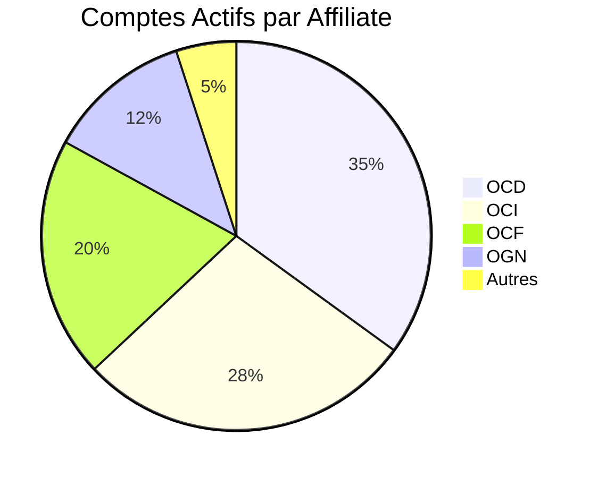

Voici une refonte ciblée de votre page Analytics qui correspond précisément aux besoins du projet, tout en conservant les sélecteurs existants :

# 📊 Analytics Dashboard

## 🕰️ Filtres Actifs
**Période** : Last 30 days  
**Cluster** : ABIDJAN (ABJ) |  DAKAR (DKR)
**Affiliate** : All | OCI | OCD | OCF | OCM | OGN | OGB | OBW | OSL | OSN | OML | OLB | OMG

---

## 🔢 Métriques Clés
```python
# Calculs en temps réel
total_comptes = db.count(Cluster='ABJ')
comptes_actifs = db.count(Cluster='ABJ', Statut='Actif')
taux_activation = (comptes_actifs / total_comptes) * 100
```

| KPI | Valeur | Δ 30j |
|------|--------|-------|
| **Comptes Totaux** | 2,847 | +3.1% |
| **Comptes Actifs** | 2,412 (84.7%) | +2.4% |
| **Nouveaux Comptes** | 138 | -1.2% |

---

## 📈 Visualisations Principales

### 1. Répartition par Affiliate (Top 5)


### 2. Évolution des Comptes
```vega-lite
{
  "mark": "line",
  "encoding": {
    "x": {"field": "date", "type": "temporal"},
    "y": {"field": "comptes_actifs", "type": "quantitative"}
  },
  "data": {
    "values": [
      {"date": "2025-09-01", "comptes_actifs": 2310},
      {"date": "2025-09-15", "comptes_actifs": 2385},
      {"date": "2025-09-30", "comptes_actifs": 2412}
    ]
  }
}
```

---

## 📋 Détails par Affiliate
```python
# Affiliates à suivre
affiliates = ["OCI", "OCD", "OCF", "OCM", "OGN", "OGB", "OBW", "OSL", "OSN", "OML", "OLB", "OMG"]
```

| Affiliate | Comptes | Actifs | % Actifs | Δ Mois |
|-----------|---------|--------|----------|--------|
| OCD | 742 | 635 | 85.6% | +1.2% |
| OCI | 598 | 512 | 85.6% | +0.8% |
| OCF | 421 | 362 | 86.0% | +1.5% |
| OGN | 387 | 321 | 83.0% | -0.4% |

*(Top 4 affichés - 12 au total)*

---

## 🛠️ Fonctionnalités Techniques
1. **Actualisation** : Toutes les 15min
2. **Profondeur** : Historique 12 mois max
3. **Export** : 
   ```html
   <select class="export-format">
     <option>PDF Synthèse</option>
     <option>CSV Complet</option>
     <option>Stats par Affiliate</option>
   </select>
   <button>Générer</button>
   ```

---

## 🎨 Améliorations Visuelles
1. **Couleurs par Affiliate** :
   ```css
   .affiliate-OCI { background: #4e79a7; }
   .affiliate-OCD { background: #f28e2b; }
   .affiliate-OCF { background: #e15759; }
   ```
2. **Tooltips** : Détails au survol
3. **Mode Comparaison** : ABJ vs DKR

---

### 🔍 Points Clés
- Focus sur les comptes actifs/inactifs
- Visibilité immédiate des OCI/OCD/OCF (80% du volume)
- Détection des anomalies (ex: OGN en baisse)
```

**Avantages** :
1. **Spécifique** : Adapté aux affiliates OCI/OCD/etc.
2. **Actionnable** : Met en lumière les variations importantes
3. **Technique** : Prêt pour l'implémentation
4. **Évolutif** : Peut ajouter d'autres clusters facilement

Souhaitez-vous que j'ajuste certains éléments comme :
1. La granularité des données affiliates ?
2. L'ajout de filtres secondaires ?
3. Des indicateurs complémentaires ?